# Vulkan Real-Time Raytracer — Technical Manual

> **Branch:** `refactor/radiance-cascades`  
> **Renderer:** Modern deferred pipeline with Sparse Radiance Cascades GI (default) + Legacy monolithic raytracer (toggle)  
> **Target:** 1280×720, Vulkan 1.3, compute-only (no graphics pipeline)

---

## Table of Contents

1. [Project Overview](#1-project-overview)
2. [Build & Setup](#2-build--setup)
3. [High-Level Architecture](#3-high-level-architecture)
4. [GPU Data Model](#4-gpu-data-model)
5. [The Render Pipeline — Overview](#5-the-render-pipeline--overview)
6. [Per-Pass Deep Dives](#6-per-pass-deep-dives)
   - 6.1 [Primary Visibility (G-Buffer)](#61-primary-visibility-g-buffer)
   - 6.2 [Probe Allocation](#62-probe-allocation)
   - 6.3 [Probe Tracing](#63-probe-tracing)
   - 6.4 [Cascade Merge](#64-cascade-merge)
   - 6.5 [SH Pre-Integration](#65-sh-pre-integration)
   - 6.6 [Final Gather](#66-final-gather)
   - 6.7 [Reflections](#67-reflections)
   - 6.8 [Transparency & Refraction](#68-transparency--refraction)
   - 6.9 [Tonemapping](#69-tonemapping)
7. [Radiance Cascade Theory](#7-radiance-cascade-theory)
8. [BVH System](#8-bvh-system)
9. [Material System](#9-material-system)
10. [Camera & Input](#10-camera--input)
11. [Legacy Pipeline](#11-legacy-pipeline)
12. [Appendix A — GLSL Conventions](#appendix-a--glsl-conventions)
13. [Appendix B — Descriptor Set Index](#appendix-b--descriptor-set-index)
14. [Appendix C — Known Bugs Fixed](#appendix-c--known-bugs-fixed)

---

## 1. Project Overview

This project is a **real-time global illumination raytracer** running entirely on GPU via Vulkan compute shaders. There is no rasterisation pipeline. Every frame:

1. A **primary visibility** compute pass traces a ray per pixel into the scene and writes world-space hit data into a G-Buffer.
2. A **Sparse Radiance Cascades (SRC)** system allocates, traces, merges, and integrates probe irradiance.
3. **Shading passes** read the G-Buffer and cascade data to produce a physically-based lit image.
4. A **tonemap** pass converts HDR → LDR → swapchain.

The codebase lives at two layers:

| Layer | Purpose |
|---|---|
| **C++ host** | Vulkan initialisation, buffer/image management, pipeline creation, per-frame dispatch, camera input |
| **GLSL compute** | All rendering — intersection, shading, GI, tonemapping |

### Feature Summary

| Feature | Status |
|---|---|
| BVH-accelerated triangle mesh rendering | ✅ |
| Analytical spheres, planes, quads, cubes | ✅ |
| PBR (Cook-Torrance) + Blinn-Phong shading | ✅ |
| Texture maps (albedo, normal, roughness, AO) | ✅ |
| Parallax occlusion mapping | ✅ |
| Procedural patterns (checker, wood, marble) | ✅ |
| Soft shadows (area lights, multiple shadow rays) | ✅ (legacy) |
| Depth-of-field (thin lens) | ✅ (legacy) |
| Exponential fog + sky gradient | ✅ |
| First-order reflections | ✅ |
| Snell's law refraction chains | ✅ |
| Sparse Radiance Cascades GI | ✅ |
| SH L0+L1 probe irradiance | ✅ |
| ACES / Reinhard / Linear tonemapping | ✅ |
| Per-pass GPU timestamps + VRAM stats | ✅ |
| ImGui debug overlay | ✅ |

---

## 2. Build & Setup

### Prerequisites

- **Visual Studio 2022** (x64 toolchain)
- **Vulkan SDK** installed system-wide — sets `$(VULKAN_SDK)` environment variable
- `glslc` on PATH (ships with the Vulkan SDK)

### Build

```
Open: Vulkan-Engine/Vulkan-Engine.sln
Configuration: Debug or Release, x64
Press F7 or Build → Build Solution
```

### Compile Shaders

Run from inside `Vulkan-Engine/`:
```bat
compile_shaders.bat
```

This calls `glslc --target-env=vulkan1.3` on every `.comp`/`.vert`/`.frag` file found in:
- `shaders/legacy/`
- `shaders/visibility/`
- `shaders/rc/`
- `shaders/shading/`
- `shaders/tonemap/`

Outputs `.spv` files alongside each source. **Always recompile after editing any shader.**

> ⚠️ **Unicode in .comp files breaks `glslc`.** Visual Studio may save `.comp` files as UTF-16 BOM if you paste text from outside. Use only ASCII in all shader source files.

### Directory Layout

```
Vulkan-Engine/
├── source/
│   ├── core/          VulkanCore.cpp, VulkanContext.cpp, CommandManager.cpp, Swapchain.cpp
│   ├── renderer/      Renderer.cpp  (main orchestrator, replaces VulkanCore)
│   ├── scene/         ModelLoader.cpp, ImageLoader.cpp, Primitive.cpp
│   ├── gi/            CascadeHashMap.cpp, CascadeStorage.cpp
│   ├── passes/        GBuffer.cpp
│   ├── debug/         DebugUI.cpp
│   └── resources/     Buffer.cpp, Image.cpp
├── include/           (mirrors source/ structure, same subdirectories)
├── shaders/
│   ├── common/        ray.glsl, bvh.glsl, material.glsl, lighting.glsl,
│   │                  shadow.glsl, octahedral.glsl, cascade_layout.glsl,
│   │                  push_constants.glsl, random.glsl
│   ├── legacy/        raytracer.comp   (monolithic raytracer)
│   ├── visibility/    primary.comp     (G-buffer fill)
│   ├── rc/            probe_alloc.comp, probe_trace.comp,
│   │                  cascade_merge.comp, probe_sh.comp
│   ├── shading/       final_gather.comp, reflection.comp, transparent.comp,
│   │                  composite_temp.comp
│   └── tonemap/       tonemap.comp
└── reference-files/   PDFs, dev diary, this manual
```

---

## 3. High-Level Architecture

### 3.1 C++ Class Diagram

```mermaid
classDiagram
    direction TB

    class Renderer {
        +run()
        +loadScene()
        +loadTextures()
        +recreateCascades()
        +CascadeConfig rcConfig
        +float kIndirectScale
        +int debugMode
        -recordCommandBuffer()
        -drawFrame()
        -processInput()
        -updateDynamicData()
    }

    class VulkanContext {
        +VkInstance instance
        +VkDevice device
        +VkPhysicalDevice physicalDevice
        +VkQueue computeQueue
        +uint32_t computeQueueFamily
        +VmaAllocator allocator
        +VkSurfaceKHR surface
        +initialize(GLFWwindow*)
        +shutdown()
    }

    class Swapchain {
        +VkSwapchainKHR handle
        +VkExtent2D extent
        +vector~VkImage~ images
        +vector~VkImageView~ imageViews
        +create(ctx, surface, extent)
        +destroy(ctx)
    }

    class CommandManager {
        +VkCommandPool pool
        +VkCommandBuffer buffer
        +VkSemaphore imageAvailableSemaphore
        +vector~VkSemaphore~ renderFinishedSemaphores
        +VkFence inFlightFence
        +beginOneTime()
        +submitOneTime()
    }

    class GBuffer {
        +Image position       // rgba32f: xyz=world pos, w=depth
        +Image normal         // rgba16f: xyz=normal, w=roughness
        +Image albedo         // rgba8:   rgb=albedo, a=metallic
        +Image emissive       // rgba16f: rgb=emissive, a=matIndex
        +Image linearDepth    // r32f:    scene depth
        +Image hdrOutput      // rgba16f: lit HDR (at binding 5)
        +transitionForWrite()
        +transitionForRead()
    }

    class CascadeConfig {
        +int numCascades = 3
        +int branchingFactor = 2
        +vec3 worldOrigin
        +ivec3 gridSize0
        +float spacing0 = 0.5
        +int octRes0 = 4
        +gridSize(level)
        +spacing(level)
        +octRes(level)
        +intervalStart(level)
        +intervalEnd(level)
    }

    class CascadeStorage {
        +vector~CascadeHashMap~ levels
        +vector~uint32_t~ hashTableSize
        +vector~uint32_t~ maxActiveSlots
        +initialize(ctx, config)
        +destroy()
    }

    class CascadeHashMap {
        +Buffer hashKeys       // uint[tableSize]
        +Buffer hashValues     // uint[tableSize]
        +Buffer slotToKey      // uint[maxActiveSlots]
        +Buffer slotCounter    // uint[1]
        +Buffer cascadeData    // uvec2[maxSlots * octRes^2]
        +Buffer shCoeffs       // vec4[maxSlots * 4]
        +create()
        +destroy()
    }

    class Buffer {
        +VkBuffer handle
        +VmaAllocation alloc
        +void* mapped
        +Buffer(allocator, size, usage, memUsage)
    }

    class Image {
        +VkImage handle
        +VmaAllocation alloc
        +VkImageView view
        +Image(allocator, w, h, format, usage, memUsage)
        +destroy(allocator)
    }

    class ModelLoader {
        +load(filename, triangles, bvhNodes, matIdx, pos, rot, scale)$
        -loadOBJ()
        -buildBVH()
        -subdivideSAH()
        -updateNodeBounds()
    }

    class ImageLoader {
        +load(path) int$
        +loadPixels(path)$
        +freePixels(img)$
    }

    class DebugUI {
        +init(ctx, swapchain, window)
        +draw(renderer, stats)
        +renderOnSwapchain(cmd, view, extent)
        +shutdown(ctx)
    }

    class FrameStats {
        +float frameTimeMs
        +float gpuTotalMs
        +float gpuPrimaryMs
        +float gpuTraceMs
        +float gpuMergeMs
        +float gpuGatherMs
        +float gpuTransparentMs
        +float gpuTonemapMs
        +uint64_t vramUsedBytes
        +uint64_t vramBudgetBytes
    }

    Renderer --> VulkanContext
    Renderer --> Swapchain
    Renderer --> CommandManager
    Renderer --> GBuffer
    Renderer --> CascadeStorage
    Renderer --> CascadeConfig
    Renderer --> DebugUI
    Renderer --> FrameStats
    Renderer "1" --> "8" Buffer : scene SSBOs
    Renderer "1" --> "2" Image : hdrImage, ldrImage

    CascadeStorage --> CascadeConfig
    CascadeStorage "1" --> "N" CascadeHashMap

    CascadeHashMap "1" --> "6" Buffer

    GBuffer "1" --> "6" Image

    ModelLoader ..> GPUTriangle : produces
    ModelLoader ..> GPUBVHNode : produces
    ImageLoader ..> Buffer : staging
```

### 3.2 Module Dependency Graph

```mermaid
graph TD
    main["main.cpp\n(scene setup)"] --> Renderer

    Renderer --> VulkanContext
    Renderer --> Swapchain
    Renderer --> CommandManager
    Renderer --> GBuffer
    Renderer --> CascadeStorage
    Renderer --> DebugUI

    CascadeStorage --> CascadeHashMap
    CascadeHashMap --> Buffer

    GBuffer --> Image

    Renderer --> ModelLoader
    Renderer --> ImageLoader

    subgraph "Shader Includes"
        ray_glsl["ray.glsl\nAABB slab, sphere, triangle intersect"]
        bvh_glsl["bvh.glsl\nBVH traversal, GPUTriangle"]
        material_glsl["material.glsl\nGPUMaterial, sampleAlbedo, patterns"]
        lighting_glsl["lighting.glsl\nGPULight, PBR, Blinn-Phong"]
        shadow_glsl["shadow.glsl\ntraverseBVHShadow"]
        oct_glsl["octahedral.glsl\noctEncode/Decode/IndexToUV"]
        cascade_glsl["cascade_layout.glsl\npackKey, hash map, pack/unpack radiance"]

        ray_glsl --> bvh_glsl
        material_glsl --> lighting_glsl
        bvh_glsl --> shadow_glsl
        lighting_glsl --> shadow_glsl
    end

    subgraph "Shader Passes"
        primary["primary.comp\nG-Buffer fill"]
        probe_alloc["probe_alloc.comp\nSparse probe allocation"]
        probe_trace["probe_trace.comp\nPer-probe ray tracing"]
        cascade_merge["cascade_merge.comp\nInterval compositing"]
        probe_sh["probe_sh.comp\nSH L0+L1 projection"]
        final_gather["final_gather.comp\nDirect + indirect light"]
        reflection["reflection.comp\nFog + reflections"]
        transparent["transparent.comp\nRefraction chains"]
        tonemap["tonemap.comp\nHDR → LDR"]
    end

    bvh_glsl --> primary
    bvh_glsl --> probe_trace
    bvh_glsl --> final_gather
    cascade_glsl --> probe_alloc
    cascade_glsl --> probe_trace
    cascade_glsl --> cascade_merge
    cascade_glsl --> final_gather
    oct_glsl --> probe_trace
    oct_glsl --> cascade_merge
    oct_glsl --> probe_sh
```

---

## 4. GPU Data Model

### 4.1 GPU Structs (std430 Layout)

All CPU-side structs in `include/scene/GPUData.hpp` mirror GLSL structs exactly.  
**Rule:** every `vec3` field must be followed by a `float pN` padding field to satisfy std430's 16-byte base alignment.

```cpp
// GPUMaterial — 128 bytes
struct GPUMaterial {
    glm::vec3 color;      float ambient;        // 16 bytes
    glm::vec3 emission;   float diffuse;        // 16 bytes
    glm::vec3 color2;     float specular;       // 16 bytes

    float reflection;     float transparency;
    float ior;            int   shadingModel;   // 16 bytes

    int   patternType;    float roughness;
    float metallic;       int   castShadows;    // 16 bytes

    int   useTexture;     int   albedoIndex;
    int   normalMapIndex; int   roughnessIndex; // 16 bytes

    int   aoIndex;        int   heightMapIndex;
    float proceduralScale; float proceduralWobble; // 16 bytes

    float bumpStrength;   float parallaxScale;
    float p5;             float p6;             // 16 bytes
};

// GPUBVHNode — 32 bytes
struct GPUBVHNode {
    glm::vec3 aabbMin;    int leftFirst;  // 16 bytes
    glm::vec3 aabbMax;    int triCount;   // 16 bytes
    // leftFirst: leaf=first triangle index, internal=left child index
    // triCount:  leaf=N triangles, internal=0 (distinguishes leaf vs internal)
};
```

### 4.2 GPUTriangle UV Packing

The triangle struct repurposes the vec3 padding slots to carry per-vertex UVs:

```
  v0 (xyz) | uv0x     ← vertex 0 position + UV.x
  v1 (xyz) | uv0y     ← vertex 1 position + UV.y for vertex 0
  v2 (xyz) | uv1x     ← vertex 2 position + UV.x for vertex 1
  n0 (xyz) | uv1y     ← vertex 0 normal   + UV.y for vertex 1
  n1 (xyz) | uv2x     ← vertex 1 normal   + UV.x for vertex 2
  n2 (xyz) | isSmooth ← vertex 2 normal   + smooth flag
  materialIndex | uv2y | p7 | p8
```

### 4.3 Scene SSBOs — Binding Layout

The **sceneDescSetLayout** (set 0) is shared by all passes that need scene geometry:

| Binding | Type | Contents |
|---|---|---|
| 0 | Storage Image | Output image placeholder (unused in multi-pass) |
| 1 | SSBO | `GPUMaterial[]` |
| 2 | SSBO | `GPUSphere[]` |
| 3 | SSBO | `GPUTriangle[]` ← also consumed by bvh.glsl |
| 4 | SSBO | `GPULight[]` |
| 5 | SSBO | `GPUPlane[]` |
| 6 | SSBO | `GPUQuad[]` |
| 7 | SSBO | `GPUCube[]` |
| 8 | SSBO | `GPUBVHNode[]` ← also consumed by bvh.glsl |
| 9 | Combined Image Sampler [100] | Texture array |

### 4.4 G-Buffer Layout (set 1)

```
Binding 0: gPosition    rgba32f   |  X  |  Y  |  Z  | depth |
Binding 1: gNormal      rgba16f   | Nx  | Ny  | Nz  | rough |
Binding 2: gAlbedo      rgba8     |  R  |  G  |  B  | metal |
Binding 3: gEmissive    rgba16f   | eR  | eG  | eB  | matID |
Binding 4: gLinearDepth r32f      |  t  |     |     |       |
Binding 5: outHDR       rgba16f   | hR  | hG  | hB  |   1   |  ← written by gather, read by reflection/transparent/tonemap
```

> **Sky pixels**: flagged by `gEmissive.a < 0` (set to -1.0 in primary.comp). All subsequent passes skip processing these pixels and the sky colour is passed through directly.

### 4.5 RC Hash Map Layout (set 1 per cascade level)

Each cascade level has one `CascadeHashMap` with 6 SSBO bindings:

| Binding | Buffer | Contents |
|---|---|---|
| 0 | `hashKeys` | `uint[tableSize]` — packed cell keys, `0xFFFFFFFF` = empty |
| 1 | `hashValues` | `uint[tableSize]` — slot index for each occupied key |
| 2 | `slotToKey` | `uint[maxActiveSlots]` — reverse map: slot → cell key |
| 3 | `slotCounter` | `uint[1]` — atomic counter for active probe count |
| 4 | `cascadeData` | `uvec2[maxSlots × octRes²]` — packed (radiance, transmittance) per direction |
| 5 | `parentCascadeData` | `uvec2[]` — aliased to parent level's cascadeData (merge pass only) |
| 6 | `shCoeffs` | `vec4[maxSlots × 4]` — L0+L1 SH coefficients after probe_sh.comp |

---

## 5. The Render Pipeline — Overview

### 5.1 Frame Sequence Diagram

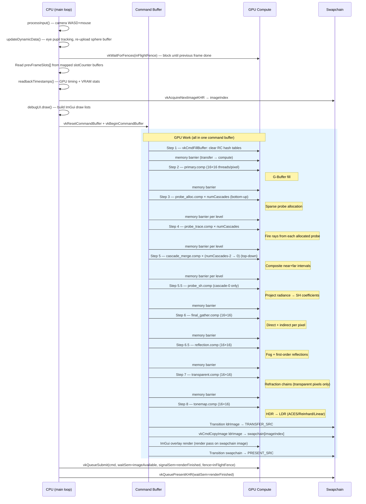

### 5.2 Full Pipeline Flowchart

```mermaid
flowchart TD
    START([Frame Start]) --> CLEAR

    CLEAR["🧹 Clear RC Hash Tables\nvkCmdFillBuffer: hashKeys=0xFFFFFFFF, slotCounter=0\nfor each cascade level"] --> PRI

    PRI["👁️ PASS 1: Primary Visibility\nprimary.comp — 1 thread/pixel\nOutputs G-Buffer:\ngPosition, gNormal, gAlbedo,\ngEmissive, gLinearDepth"] --> ALLOC

    ALLOC["📦 PASS 2: Probe Allocation\nprobe_alloc.comp — 3 levels\nLevel 0: 1 thread/G-buffer pixel\nLevel 1–2: 1 thread/parent slot\nBuilds sparse hash map per level"] --> TRACE

    TRACE["🔦 PASS 3: Probe Tracing\nprobe_trace.comp — 3 levels\n1 thread/(slot × octRes²)\nFires octRes² rays per probe\nStores (radiance, transmittance)"] --> MERGE

    MERGE["🔀 PASS 4: Cascade Merge\ncascade_merge.comp — 2 levels\nTop-down: level 1→0\nmerged.L = near.L + near.T × far.L\nmerged.T = near.T × far.T"] --> SH

    SH["📐 PASS 5: SH Pre-Integration\nprobe_sh.comp — cascade 0 only\nProjects octRes² samples → 4×vec4 SH\nc0, cx, cy, cz coefficients"] --> GATHER

    GATHER["💡 PASS 6: Final Gather\nfinal_gather.comp — 1 thread/pixel\nDirect: PBR/Blinn-Phong + shadows\nIndirect: trilinear SH probe lookup\nWrites outHDR"] --> REFLECT

    REFLECT["🪞 PASS 6.5: Reflections + Fog\nreflection.comp — 1 thread/pixel\nFog: Beer-Lambert exp attenuation\nReflections: analytical+BVH ray\nBlends with outHDR"] --> TRANS

    TRANS["🔮 PASS 7: Transparency\ntransparent.comp — transparent pixels only\nReconstructs primary ray\nRefraction/reflection depth loop (max 4)\nShades with SH probes\nOverwrites outHDR"] --> TONE

    TONE["🎞️ PASS 8: Tonemapping\ntonemap.comp — 1 thread/pixel\nhdrImage × exposure\nACES Film / Reinhard / Linear\nGamma 2.2 → ldrImage"] --> COPY

    COPY["📋 Copy ldrImage → Swapchain\nvkCmdCopyImage\nR8G8B8A8_UNORM → present"] --> IMGUI

    IMGUI["🖥️ ImGui Overlay\nRender to swapchain color attachment\n(separate render pass)"] --> END

    END([Present])
```

---

## 6. Per-Pass Deep Dives

### 6.1 Primary Visibility (G-Buffer)

**Shader:** `shaders/visibility/primary.comp`  
**Dispatch:** `(width/16, height/16, 1)` — one 16×16 workgroup per tile of pixels  
**Purpose:** Cast one ray per pixel and record the first-hit surface properties into the G-Buffer. No shading is performed here.

#### Ray Construction

```glsl
// Map pixel (i,j) to [-aspect*fovTan, aspect*fovTan] × [-fovTan, fovTan]
vec2 uv = (vec2(pixel) + 0.5) / vec2(size) * 2.0 - 1.0;
uv.y = -uv.y;                              // flip Y (screen top-left vs math bottom-left)
uv.x *= float(size.x) / float(size.y);    // aspect ratio correction
uv *= tan(radians(60.0 * 0.5));            // FOV = 60 degrees

vec3 rayDir = normalize(cam.camRight*uv.x + cam.camUp*uv.y + cam.camForward);
```

#### Hybrid Analytical + BVH Intersection Strategy

Planes and quads are infinite (or room-sized) and are **never added to the BVH**. If they were, the BVH would contain giant bounding boxes spanning the whole scene, forcing every ray to visit nearly all BVH nodes — O(N) traversal instead of O(log N).

Instead, primary.comp tests planes and quads analytically first:

```glsl
// 1. Test all planes/quads analytically — O(count) but count is always small (≤ 10)
//    Record the closest analytical hit as analyticalT.

// 2. Set ray.tMax = analyticalT before calling traverseBVH().
//    This culls any BVH node whose AABB entry > analyticalT,
//    which eliminates most of the BVH for wall pixels.
ray.tMax = analyticalT;
bool hasBVH = traverseBVH(ray, cam.bvhCount, hit);
```

This "hybrid" approach caps ray.tMax before BVH traversal, making BVH traversal O(log N) even for rays that hit large flat surfaces first.

#### G-Buffer Output

```glsl
imageStore(gPosition,    pixel, vec4(hit.position,    hit.t));
imageStore(gNormal,      pixel, vec4(normal,           mat.roughness));
imageStore(gAlbedo,      pixel, vec4(color,            mat.metallic));
imageStore(gEmissive,    pixel, vec4(mat.emission,     float(hit.materialIndex)));
imageStore(gLinearDepth, pixel, vec4(hit.t,            0, 0, 0));
// Sky pixels: gEmissive.a = -1.0 (negative signals "no geometry hit")
```

---

### 6.2 Probe Allocation

**Shader:** `shaders/rc/probe_alloc.comp`  
**Dispatch (level 0):** `(width/16+1, height/16+1, 1)` — one thread per G-buffer pixel  
**Dispatch (level k>0):** `(prevSlots[k-1]/256+1, 1, 1)` — one thread per occupied parent slot  
**Purpose:** Determine which 3D grid cells need probes this frame by populating a GPU hash map.

#### Two Allocation Modes

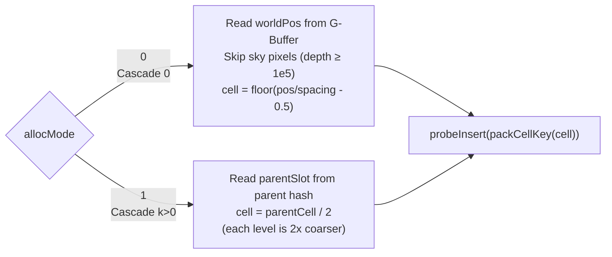

#### Cell Key Encoding

Cell coordinates `(x, y, z)` are packed into one `uint32` to fit in a hash map slot:

```
 Bit 18      12       6       0
 ┌────────────┬───────┬───────┐
 │  Z (7 bit) │Y (6b) │X (6b) │
 └────────────┴───────┴───────┘
```

Max grid: 64×64×128 cells — sufficient to cover the 30×25×45-unit room at spacing=0.5.

#### GPU Atomic Hash Map Insert

```glsl
// Open-addressing hash map with linear probing.
// atomicCompSwap atomically: if hashKeys[idx] == 0xFFFFFFFF → write key and return 0xFFFFFFFF
//                           if hashKeys[idx] == key         → already present, return key
//                           otherwise                       → collision, probe next slot
bool probeInsert(uint key, uint tableSize) {
    uint h = (key * 2654435761u) % tableSize;   // Knuth multiplicative hash
    for (uint i = 0; i < tableSize; i++) {
        uint idx  = (h + i) % tableSize;
        uint prev = atomicCompSwap(hashKeys[idx], 0xFFFFFFFF, key);

        if (prev == 0xFFFFFFFF) {
            // Won the slot: assign a dense slot index
            uint slot = atomicAdd(nextSlot, 1u);
            hashValues[idx] = slot;
            slotToKey[slot] = key;
            return true;
        }
        if (prev == key) return false;  // already in table
    }
    return false;  // table full
}
```

**Why atomic?** Thousands of threads call `probeInsert` simultaneously. Two threads for adjacent pixels will often land on the same grid cell. The CAS (Compare-And-Swap) ensures only one thread claims the slot; others detect `prev == key` and return harmlessly.

---

### 6.3 Probe Tracing

**Shader:** `shaders/rc/probe_trace.comp`  
**Dispatch:** `(prevSlots[level] × octRes² / 256 + 1, 1, 1)` — 1D, one thread per ray  
**Purpose:** For each allocated probe, fire `octRes²` rays (one per direction on the octahedral grid) and record radiance + transmittance.

#### Thread Decomposition

```glsl
uint globalIdx   = gl_GlobalInvocationID.x;
uint raysPerProbe = uint(octRes * octRes);
uint slot        = globalIdx / raysPerProbe;   // which probe
uint localRay    = globalIdx % raysPerProbe;   // which direction within that probe
```

All threads in a workgroup (256 threads) handle the same probe's directions — good for cache coherency since they all read the same `slotToKey[slot]` and `cascadeData[storageBase]` base.

#### Ray Setup and Hybrid Intersection

```glsl
// Decode octahedral grid index → 3D direction
vec2 uv  = octIndexToUV(ivec2(dx, dy), octRes);
vec3 dir = octDecode(uv);

// Shoot from probe world position, within the cascade's depth interval
Ray ray;
ray.origin    = probeWorldPos(cell, worldOrigin, spacing);
ray.direction = dir;
ray.tMin      = intervalStart + 0.001;
ray.tMax      = intervalEnd;

// Same hybrid strategy as primary.comp:
// test planes/quads analytically first → cap ray.tMax → BVH traversal
```

#### Radiance Evaluation

```glsl
if (didHit) {
    radiance      = mat.emission;             // always include emissive
    transmittance = 0.0;                      // hit → no transmission through

    if (evaluateDirect != 0) {               // only for cascade-0
        // Single-bounce direct lighting — baked into probe so gather
        // pass doesn't need to re-fire shadow rays per pixel.
        for each light l:
            NdotL = dot(hitN, lightDir);
            // Analytical shadow (planes/quads) + BVH shadow
            shadowAtten = analyticalPlaneQuadShadow() * traverseBVHShadow();
            radiance += albedo * diffuse * NdotL * lightColor * shadowAtten * attenuation;
    }
} else {
    // Miss: this direction is open sky — parent cascade will fill it at merge time
    radiance      = vec3(0.0);
    transmittance = 1.0;
}

cascadeData[storageBase + dy*octRes + dx] = packRadianceTransmittance(radiance, transmittance);
```

#### Radiance Packing (uvec2, FP16)

Radiance `(R, G, B)` and transmittance `T` are packed into 8 bytes to minimize memory:

```glsl
uvec2 packRadianceTransmittance(vec3 L, float T) {
    return uvec2(
        packHalf2x16(vec2(L.xy)),   // R,G as FP16
        packHalf2x16(vec2(L.z, T))  // B,T as FP16
    );
}
```

`uvec2` avoids the `GL_EXT_shader_explicit_arithmetic_types_int64` extension required for `uint64_t`.

---

### 6.4 Cascade Merge

**Shader:** `shaders/rc/cascade_merge.comp`  
**Dispatch:** top-down, level `N-2` → `0`. Level `N-1` is skipped (it has no parent).  
**Purpose:** Composite each probe's short-interval radiance with the trilinearly-interpolated long-interval radiance from the coarser parent cascade.

#### Why Top-Down?

The parent level must be **fully merged** before any child reads from it. Merging in the wrong order (bottom-up) would cause children to read un-merged parent data.

#### Volume Rendering Compositing

This is the mathematical heart of Radiance Cascades. Two adjacent depth intervals are composited like layers in front-to-back volume rendering:

```
merged.L = near.L + near.T × far.L      (add far light attenuated by near medium)
merged.T = near.T × far.T               (transmittance is the product of both)
```

```glsl
// In cascade_merge.comp:

// 1. Look up 8 parent probes surrounding this probe in space (trilinear)
vec3 pSpace = (worldPos - worldOrigin) / parentSpacing - 0.5;
ivec3 pBase = ivec3(floor(pSpace));
vec3 fParent = pSpace - vec3(pBase);

vec4 parentAccum = vec4(0.0, 0.0, 0.0, 1.0); // T=1 if no parent found (boundary)
float weightSum = 0.0;

for pz in {0,1}: for py in {0,1}: for px in {0,1}:
    ivec3 pCell = pBase + ivec3(px,py,pz);
    uint pSlot = probeLookupInParent(packCellKey(pCell), parentHashSize);
    if (pSlot == NOT_FOUND) continue;
    float w = ((px==0)?(1-f.x):f.x) * ((py==0)?(1-f.y):f.y) * ((pz==0)?(1-f.z):f.z);
    parentAccum += sampleParentProbe(pSlot, dir) * w;
    weightSum += w;

if (weightSum > 0.001) parentAccum /= weightSum;

// 2. Composite
vec4 my = unpackRadianceTransmittance(cascadeData[myIdx]);
cascadeData[myIdx] = packRadianceTransmittance(
    my.rgb + my.a * parentAccum.rgb,   // near radiance + transmitted far radiance
    my.a   * parentAccum.a             // product transmittances
);
```

#### Bilinear Angular Filter

When reading the parent probe, a 2×2 bilinear filter is applied within the parent's octahedral map. This smooths directional transitions at low octahedral resolutions (cascade 0 = 4×4 = 16 directions):

```glsl
vec4 sampleParentProbe(uint parentSlot, vec3 direction) {
    vec2 uv  = octEncode(direction);         // encode direction to [0,1]^2
    vec2 idx = uv * float(pOctRes) - 0.5;   // fractional texel index
    ivec2 i0 = ivec2(floor(idx));
    vec2 f   = idx - vec2(i0);

    // 2×2 bilinear tap
    for dy in {0,1}: for dx in {0,1}:
        float w = (dx==0?(1-f.x):f.x) * (dy==0?(1-f.y):f.y);
        acc += unpackRadiance(parentCascadeData[...]) * w;
    return acc;
}
```

---

### 6.5 SH Pre-Integration

**Shader:** `shaders/rc/probe_sh.comp`  
**Dispatch:** cascade-0 only — `(prevSlots[0]/256+1, 1, 1)`  
**Purpose:** Compress the 16-sample cascade-0 radiance into 4 SH coefficients per probe so that shading passes can query irradiance with a single dot product instead of a 16-iteration loop.

#### Spherical Harmonics L0+L1

The irradiance function (how much light arrives at a surface from all directions, weighted by the cosine lobe for Lambert diffuse) can be approximated as:

```
irradiance(n̂) = sh0 + sh1·n.x + sh2·n.y + sh3·n.z
```

where `sh0..sh3` are the 4 L0+L1 SH coefficients projected from the sampled radiance.

```glsl
// Scale factors absorb the SH basis norms, solid angle weight, and cosine lobe factor
float K0 = PI / (2.0 * float(N));          // L0: isotropic ambient
float K1 = 3.0 * PI / (2.0 * float(N));    // L1: directional

vec3 c0=vec3(0), cx=vec3(0), cy=vec3(0), cz=vec3(0);
for (int d = 0; d < N; d++) {
    vec3 dir = octDecode(octIndexToUV(...));
    vec3 L   = unpackRadiance(cascadeData[base + d]);
    c0 += L;            // project onto Y_0 (constant)
    cx += L * dir.x;    // project onto Y_1,x
    cy += L * dir.y;    // project onto Y_1,y
    cz += L * dir.z;    // project onto Y_1,z
}
shCoeffs[slot*4+0] = vec4(c0*K0, 0);
shCoeffs[slot*4+1] = vec4(cx*K1, 0);
shCoeffs[slot*4+2] = vec4(cy*K1, 0);
shCoeffs[slot*4+3] = vec4(cz*K1, 0);
```

**Evaluation** in gather/transparent/reflection passes:
```glsl
vec3 sampleProbeIrradiance(uint slot, vec3 normal) {
    return max(vec3(0),
        shCoeffs[slot*4+0].rgb               // L0: ambient
      + shCoeffs[slot*4+1].rgb * normal.x    // L1: directional
      + shCoeffs[slot*4+2].rgb * normal.y
      + shCoeffs[slot*4+3].rgb * normal.z);
}
```

---

### 6.6 Final Gather

**Shader:** `shaders/shading/final_gather.comp`  
**Dispatch:** `(width/16, height/16, 1)`  
**Purpose:** For each visible pixel, compute the final lit colour by combining direct light (per-light PBR/Blinn-Phong + shadow) with indirect light (cascade-0 probe irradiance). Writes to `outHDR`.

#### Trilinear Probe Interpolation

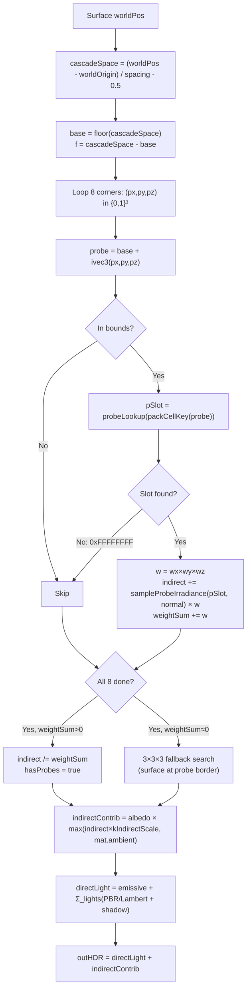

#### Direct Lighting

```glsl
for (int l = 0; l < lightCount; l++) {
    vec3  lightDir  = normalize(lights[l].position - worldPos);
    float lightDist = length(lights[l].position - worldPos);

    // Two-stage shadow: analytical (walls) → BVH (meshes)
    vec3 shadowAtten = analyticalShadow(worldPos + normal*0.001, lightDir, lightDist);
    if (dot(shadowAtten, shadowAtten) > 0.001)
        shadowAtten *= traverseBVHShadow(shadowRay, bvhCount);

    if (dot(shadowAtten, shadowAtten) > 0.001) {
        float atten = 1.0 / max(lightDist*lightDist, 0.01);  // inverse-square falloff
        vec3 attLight = lights[l].color * shadowAtten * atten;

        if (mat.shadingModel == 1)
            directLight += pbrShading(mat, albedo, normal, viewDir, lightDir, attLight);
        else {
            directLight += lambertianShading(mat, albedo, normal, lightDir, attLight);
            directLight += blingPhongShading(mat, attLight, normal, lightDir, viewDir, 50.0);
        }
    }
}
```

---

### 6.7 Reflections

**Shader:** `shaders/shading/reflection.comp`  
**Dispatch:** `(width/16, height/16, 1)` — skips sky pixels and non-reflective pixels  
**Purpose:** Applies exponential fog (all geometry pixels) and first-order reflections (pixels where `mat.reflection > 0.01`). Reads and overwrites `outHDR` in-place.

#### Reflection Ray

```glsl
vec3 reflDir = reflect(-viewDir, normal);

// 1. Test analytical planes/quads for reflection hit
// 2. Test BVH (tessellated meshes) capped at analytical T
// 3. If hit: shade the reflection surface with its own ambient + direct + SH probes
// 4. Blend: color = color*(1-reflection) + reflColor*reflection
```

#### Fog (applied after reflection blend)

```glsl
if (fogBlendWithSky == 1) {
    float fogDepth  = length(worldPos - camPos);
    float fogAtten  = exp(-fogDensity * fogDepth);     // Beer-Lambert
    vec3  fogDir    = normalize(worldPos - camPos);
    vec3  fogColor  = mix(skyBottom, skyTop, 0.5*(fogDir.y+1.0));  // sky gradient fog
    color = mix(fogColor, color, fogAtten);
}
```

---

### 6.8 Transparency & Refraction

**Shader:** `shaders/shading/transparent.comp`  
**Dispatch:** `(width/16, height/16, 1)` — early-outs on sky pixels and opaque pixels  
**Purpose:** Re-traces refraction/reflection chains through transparent objects, overwriting `outHDR` for transparent pixels. Supports up to 4 bounces of glass/ice traversal.

#### Refraction/Reflection Decision Flowchart

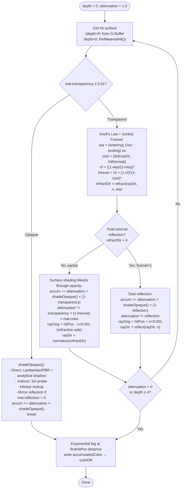

#### Snell's Law in Code

```glsl
// Determine which side of the surface the ray is on
float cosI = dot(rayDir, hitNormal);
float eta  = (cosI < 0.0) ? 1.0 / mat.ior : mat.ior;   // entering vs exiting
vec3  n    = (cosI < 0.0) ? hitNormal : -hitNormal;      // flip normal to oppose ray

cosI = abs(cosI);

// Schlick Fresnel — fraction that reflects vs transmits
float r0     = (1.0 - eta) / (1.0 + eta); r0 *= r0;
float fresnel = r0 + (1.0 - r0) * pow(1.0 - cosI, 5.0);

vec3 refractDir = refract(rayDir, n, eta);
if (length(refractDir) < 0.001) fresnel = 1.0;  // TIR
```

---

### 6.9 Tonemapping

**Shader:** `shaders/tonemap/tonemap.comp`  
**Dispatch:** `(width/16, height/16, 1)`  
**Purpose:** Convert the linear HDR `outHDR` (rgba16f) to display-ready LDR `ldrImage` (r8g8b8a8) with gamma correction.

Three modes selectable via ImGui:

| Mode | Formula | Character |
|---|---|---|
| **ACES Film** (default) | `(x(2.51x+0.03))/(x(2.43x+0.59)+0.14)` | S-curve, filmic, punchy |
| **Reinhard** | `x/(1+x)` per channel | Soft shoulder, can desaturate |
| **Linear** | `clamp(x, 0, 1)` | Reference / debug |

All modes apply **gamma correction** (linear → sRGB):
```glsl
ldr = pow(ldr, vec3(1.0 / 2.2));
```

---

## 7. Radiance Cascade Theory

### 7.1 Motivation

Traditional probe-based GI (DDGI, Lumen) places probes on a **uniform grid** — every cell has a probe regardless of whether any visible surface is nearby. At spacing=0.5 and room size 64×60×92 cells, a uniform grid would need **353,280 probes** (too expensive to trace all at 20+ FPS).

**Sparse Radiance Cascades** only allocate probes at cells that are visible in the G-buffer — typically 5,000–15,000 for a typical view, a ~20× reduction.

### 7.2 Cascade Hierarchy

Each cascade level covers a different **depth interval** along each probe ray, with increasing spacing and octahedral resolution:

| Level | Spacing | Interval | OctRes | Directions | Grid Size |
|---|---|---|---|---|---|
| 0 | 0.5 | [0.0, 0.5] | 4 | 16 | 64×60×92 |
| 1 | 1.0 | [0.5, 2.0] | 8 | 64 | 32×30×46 |
| 2 | 2.0 | [2.0, 8.0] | 16 | 256 | 16×15×23 |

**Key insight:** Far-distance GI is low-frequency (no sharp edges), so coarser probes at larger spacing produce visually correct results. Near-distance GI needs fine probes at small spacing to capture contact shadows and colour bleeding.

### 7.3 Interval Formulas

From `CascadeConfig`:
```cpp
spacing(k)       = spacing0 × 2^k
octRes(k)        = octRes0  × 2^k
intervalEnd(k)   = spacing0 × 2^(branchingFactor × k)   // branchingFactor = 2
intervalStart(k) = intervalEnd(k-1)                       // for k > 0
```

At level 2: `intervalEnd = 0.5 × 2^4 = 8.0` — GI light captured from up to 8 world units away.

### 7.4 Data Flow Summary

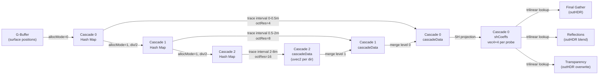

---

## 8. BVH System

### 8.1 Build (C++, CPU)

**Class:** `ModelLoader`  
**Algorithm:** Binned SAH (Surface Area Heuristic) BVH

The SAH estimates the expected ray cost for a given split:

```
cost(split) = 1 + (SA(left)/SA(parent))×N_left + (SA(right)/SA(parent))×N_right
```

where SA is the AABB surface area (proportional to the probability that a random ray hits it).

```mermaid
flowchart TD
    START(["buildBVH(triangles)"]) --> INIT

    INIT["bvhNodes.resize(triangles.size() × 2)\nroot: leftFirst=0, triCount=N\nupdateNodeBounds(root)"] --> RECURSE

    RECURSE["subdivideSAH(nodeIdx)"] --> LEAF_CHECK

    LEAF_CHECK{triCount ≤ 4?} -->|Yes: leaf| RETURN([return])

    LEAF_CHECK -->|No| BINS

    BINS["For each axis (X,Y,Z):\n1. Find centroid range [axisMin, axisMax]\n2. Scatter triangles into NUM_BINS=16 bins\n3. Build prefix counts + AABBs (left sweep)\n4. Build suffix counts + AABBs (right sweep)"] --> COST

    COST["Evaluate SAH cost at each bin boundary s:\ncost = 1 + SA(left[0..s])/SA(parent) × N_left\n         + SA(right[s+1..N])/SA(parent) × N_right\nPick minimum cost split (bestAxis, bestSplit)"] --> PRUNE

    PRUNE{bestCost <\n float(triCount)?} -->|No: leaf cheaper| RETURN

    PRUNE -->|Yes| PARTITION

    PARTITION["Partition triangles around bestSplit\n(lomuto-style swap)"] --> CHILDREN

    CHILDREN["Allocate leftChild = nodesUsed++\nAllocate rightChild = nodesUsed++\nupdateNodeBounds for each child\nConvert current node to internal:\n  leftFirst = leftChild, triCount = 0"] --> LEFT

    LEFT["subdivideSAH(leftChild)"] --> RIGHT
    RIGHT["subdivideSAH(rightChild)"] --> RETURN
```

### 8.2 Traversal (GLSL, GPU)

**File:** `shaders/common/bvh.glsl`

```glsl
bool traverseBVH(Ray ray, int bvhNodeCount, out HitInfo hit) {
    hit.t = ray.tMax;

    int stack[BVH_STACK_SIZE];   // explicit stack (no GPU call stack)
    int stackPtr = 0;
    stack[stackPtr++] = 0;       // start at root
    vec3 invDir = 1.0 / ray.direction;

    while (stackPtr > 0) {
        GPUBVHNode node = bvhNodes[stack[--stackPtr]];

        // Slab test: if AABB entry > current best hit, prune entire subtree
        if (intersectAABB(ray, invDir, node.aabbMin, node.aabbMax) >= hit.t) continue;

        if (node.triCount > 0) {
            // Leaf: test all triangles (typically 2-4)
            for (int i = 0; i < node.triCount; i++)
                // Möller-Trumbore test → update hit.t if closer
        } else {
            // Internal: push both children (right first for DFS left-priority)
            stack[stackPtr++] = node.leftFirst;
            stack[stackPtr++] = node.leftFirst + 1;
        }
    }
}
```

**Stack size:** 32 — sufficient for SAH BVH depth on meshes with ≤80K triangles.

### 8.3 Key Intersection Algorithms

#### AABB Slab Test
```glsl
// Kay & Kajiya 1986. The box is the intersection of 3 "slabs" (parallel plane pairs).
// For each axis: compute t at entry and exit of the slab.
// Hit iff the last entry (maxTmin) < earliest exit (minTmax).
float intersectAABB(Ray ray, vec3 invDir, vec3 bMin, vec3 bMax) {
    vec3 t0 = (bMin - ray.origin) * invDir;
    vec3 t1 = (bMax - ray.origin) * invDir;
    vec3 tmin = min(t0, t1), tmax = max(t0, t1);
    float maxTmin = max(max(tmin.x, tmin.y), tmin.z);
    float minTmax = min(min(tmax.x, tmax.y), tmax.z);
    return (maxTmin <= minTmax && minTmax > 0.0) ? max(maxTmin, 0.0) : 999999.0;
}
```

#### Möller-Trumbore Triangle Test
```glsl
// Solves: origin + t*dir = v0 + u*e1 + v*e2 (barycentric form).
// Uses scalar triple product (Cramer's rule) to find (t, u, v) without computing normal.
float triangleIntersect(Ray ray, vec3 v0, vec3 v1, vec3 v2, out float u, out float v) {
    vec3 e1 = v1-v0, e2 = v2-v0;
    vec3 h  = cross(ray.direction, e2);
    float a = dot(e1, h);               // = 0 when ray || triangle
    if (abs(a) < 1e-7) return -1.0;
    float f = 1.0 / a;
    vec3 s  = ray.origin - v0;
    u = f * dot(s, h);                  // barycentric u
    if (u < 0.0 || u > 1.0) return -1.0;
    vec3 q = cross(s, e1);
    v = f * dot(ray.direction, q);      // barycentric v
    if (v < 0.0 || u+v > 1.0) return -1.0;
    float t = f * dot(e2, q);
    return (t > 1e-7) ? t : -1.0;
}
```

---

## 9. Material System

### 9.1 GPUMaterial Fields

| Field | Type | Description |
|---|---|---|
| `color` | vec3 | Base diffuse colour (or colour A for procedural) |
| `ambient` | float | Minimum ambient fill factor |
| `emission` | vec3 | Self-emission (additive, not PBR energy) |
| `diffuse` | float | Lambertian scale factor |
| `color2` | vec3 | Colour B for procedural patterns |
| `specular` | float | Blinn-Phong specular multiplier |
| `reflection` | float | Mirror reflectance [0,1] |
| `transparency` | float | Glass/transmission factor [0,1] |
| `ior` | float | Index of refraction (1.0=vacuum, 1.5=glass, 1.31=ice) |
| `shadingModel` | int | 0=Blinn-Phong, 1=PBR Cook-Torrance |
| `patternType` | int | 0=Texture/flat, 1=Checker, 2=Wood, 3=Marble |
| `roughness` | float | PBR roughness (0=mirror, 1=diffuse) |
| `metallic` | float | PBR metallic factor (0=dielectric, 1=metal) |
| `castShadows` | int | 0=transparent to shadows |
| `useTexture` | int | 1=enable texture maps / procedural |
| `albedoIndex` | int | Index into texture array (-1=none) |
| `normalMapIndex` | int | Normal map index (-1=none) |
| `roughnessIndex` | int | Roughness map index (-1=none) |
| `aoIndex` | int | Ambient occlusion map index (-1=none) |
| `heightMapIndex` | int | Parallax height map index (-1=none) |
| `proceduralScale` | float | Pattern scale |
| `proceduralWobble` | float | Turbulence intensity (wood/marble) |
| `bumpStrength` | float | Normal map intensity |
| `parallaxScale` | float | Parallax occlusion depth scale |

### 9.2 PBR Cook-Torrance BRDF

```
f(V, L) = kD × (albedo/π) + kS × (NDF × G × F) / (4 × NdotV × NdotL)

NDF = GGX/Trowbridge-Reitz  — microfacet normal distribution
G   = Smith masking-shadowing  — accounts for self-shadowing microfacets
F   = Schlick Fresnel         — reflection fraction vs. refraction fraction
kD  = (1-F) × (1-metallic)   — diffuse weight (energy conservation + no diffuse for metals)
kS  = F                       — specular weight
```

### 9.3 Procedural Patterns

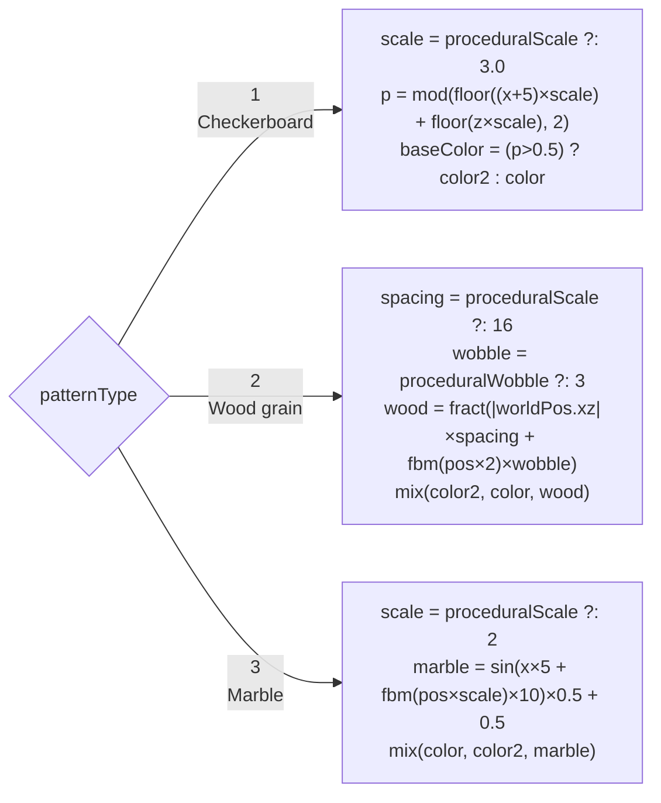

### 9.4 Parallax Occlusion Mapping

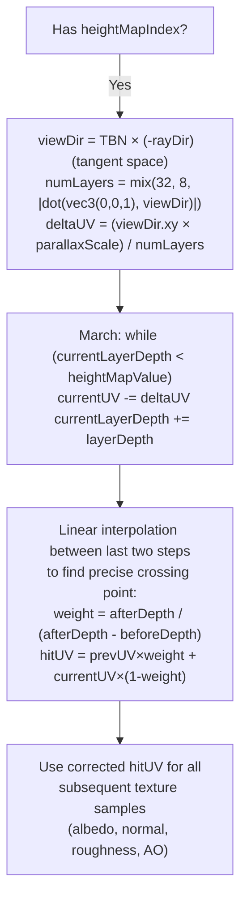

---

## 10. Camera & Input

### 10.1 Camera Construction

Camera orientation is defined by **yaw** (horizontal rotation) and **pitch** (vertical rotation) in degrees, updated each frame from keyboard input:

```cpp
// Euler angles → front vector (spherical coordinates)
cameraFront.x = cos(radians(yaw)) * cos(radians(pitch));
cameraFront.y = sin(radians(pitch));
cameraFront.z = sin(radians(yaw)) * cos(radians(pitch));
cameraFront = normalize(cameraFront);
```

The camera basis sent to the shader:
```cpp
camForward = normalize(cameraFront)
camRight   = normalize(cross(cameraUp, cameraFront))
camUp      = normalize(cross(cameraFront, camRight))   // reorthogonalised
```

### 10.2 Key Bindings

| Key | Action |
|---|---|
| W/S | Move forward/backward (horizontal plane only — `flatFront.y=0`) |
| A/D | Strafe left/right |
| Space / LCtrl | Move up/down |
| Q/E | Yaw left/right |
| Mouse click+drag | Pitch (in DebugUI ImGui window) |

### 10.3 Depth-of-Field (Legacy Pipeline)

The legacy raytracer implements a thin-lens model:

```glsl
// 1. Shoot a pinhole ray to find the focal point
vec3 focalPoint = camPos + rawDir * focalDistance;

// 2. Offset the ray origin randomly on the lens disk
vec2 disk = randomPointOnDisk() * lensRadius;
ray.origin = camPos + camRight*disk.x + camUp*disk.y;

// 3. All lens positions aim at the same focal point → sharp at focalDistance
ray.direction = normalize(focalPoint - ray.origin);
```

---

## 11. Legacy Pipeline

**Shader:** `shaders/legacy/raytracer.comp`  
**Toggle:** `Renderer::useLegacyPipeline = true` (Debug UI)

The monolithic single-pass raytracer is the original implementation, kept for comparison. It performs the **entire render in one compute dispatch** per pixel.

### 11.1 Legacy Flowchart

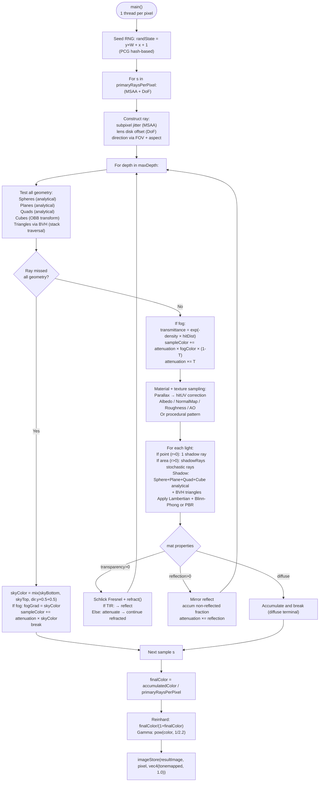

### 11.2 Legacy vs. Modern Pipeline Comparison

| Aspect | Legacy | Modern |
|---|---|---|
| GI | None (ambient constant only) | Sparse Radiance Cascades |
| Shadow rays | N per light per pixel | 1 any-hit BVH + analytical per pixel |
| Multi-sample | Yes (primaryRaysPerPixel) | No (1 ray) |
| Depth of field | Yes (thin lens) | No |
| Reflections | Multi-bounce (up to maxDepth) | 1 bounce (reflection.comp) |
| Transparency | Multi-bounce refraction | 4-bounce chain (transparent.comp) |
| Tonemapping | Reinhard only (inline) | ACES/Reinhard/Linear (tonemap.comp) |
| Performance | ~7–15 FPS (shadow rays dominate) | ~17–22 FPS |

---

## Appendix A — GLSL Conventions

### Include Guard Pattern

All `shaders/common/*.glsl` files use `#ifndef` guards to be safely `#include`-able multiple times:

```glsl
#ifndef BVH_GLSL
#define BVH_GLSL
// ... definitions ...
#endif
```

### Conditional Compilation

Some common files compile different code depending on which defines the including shader sets:

```glsl
// cascade_layout.glsl:
#ifdef RC_ALLOC_PASS
// probeInsert() — writable buffers only; excluded from readonly passes
bool probeInsert(uint key, uint tableSize) { ... }
#endif

#ifdef RC_MERGE_PASS
// probeLookupInParent() — reads parentHashKeys/parentHashValues
uint probeLookupInParent(uint key, uint tableSize) { ... }
#endif
```

### Push Constant Alignment

All push constant structs use `glm::ivec4`/`glm::vec4` instead of `glm::ivec3`/`glm::vec3` because:
- GLSL `std430` gives `vec3` a base alignment of 16 bytes
- `glm::vec3` has C++ alignment of 4 bytes
- Using `vec4` makes both sides agree without inserting manual padding

### Mandatory ASCII-only

`glslc` on Windows rejects files saved as UTF-16 BOM (Visual Studio default for new text files). All `.comp`/`.glsl` files must be saved as **UTF-8 without BOM**. Use only ASCII characters — even in comments.

---

## Appendix B — Descriptor Set Index

### Pipeline Layout Summary

| Pipeline | Set 0 | Set 1 | Set 2 | Push Constant |
|---|---|---|---|---|
| `primaryPassPipeline` | sceneDescSetLayout | gbufDescSetLayout | — | CameraPushConstants (80B) |
| `rcAllocPipeline` | gbufDescSetLayout | rcHashDescSetLayout | rcParentHashDescSetLayout | RCAllocPC (48B) |
| `rcTracePipeline` | sceneDescSetLayout | rcHashDescSetLayout | — | RCTracePC (64B) |
| `rcMergePipeline` | rcHashDescSetLayout | rcParentHashDescSetLayout | — | RCMergePC (64B) |
| `rcSHPipeline` | rcHashDescSetLayout | — | — | {octRes,maxSlots} (8B) |
| `rcGatherPipeline` | sceneDescSetLayout | gbufDescSetLayout | rcHashDescSets[0] | RCGatherPC (128B) |
| `rcReflectionPipeline` | sceneDescSetLayout | gbufDescSetLayout | rcHashDescSets[0] | RCGatherPC (128B) |
| `rcTransparentPipeline` | sceneDescSetLayout | gbufDescSetLayout | rcHashDescSets[0] | TransparentPC (128B) |
| `tonemapPipeline` | tonemapDescSetLayout | — | — | TonemapPC (16B) |

> **Note:** `rcGatherPipeline` and `rcReflectionPipeline` share the same `rcGatherPipelineLayout` — identical descriptor sets and push constant layout. This allows the same descriptor sets to be bound for both passes without any rebinding.

### rcParentHashDescSets Trick

For cascade-0 allocation (allocMode=0), set 2 is unused. However, the pipeline layout still requires a valid descriptor set at set 2. The fix is to bind `rcParentHashDescSets[0]` (a real descriptor set pointing to cascade-0's own parent-hash buffers) as a dummy:

```cpp
VkDescriptorSet allocSets[3] = {
    gbufDescSet,
    rcHashDescSets[level],
    (level == 0) ? rcParentHashDescSets[0]      // dummy for level 0 (unused)
                 : rcParentHashDescSets[level-1] // real parent for level k>0
};
```

---

## Appendix C — Known Bugs Fixed

This section documents bugs that were found and corrected during the code review session. Future contributors should be aware of these patterns.

### BUG-1: Cascade Boundary Darkening (`cascade_merge.comp`)

**Symptom:** Subtle darkening band at the edges of the cascade volume.  
**Root cause:** `parentAccum` was initialized to `vec4(0.0)` (zero transmittance). When no parent probe neighbors exist (probe is at the cascade volume boundary), the merge formula gave `merged.T = myInterval.a * 0 = 0`, making boundary probes appear to fully absorb all incoming light.  
**Fix:** Initialize `parentAccum = vec4(0.0, 0.0, 0.0, 1.0)` — correct semantics: no far radiance found, but no far absorption either.

```glsl
// Before (wrong):
vec4 parentAccum = vec4(0.0);

// After (correct):
vec4 parentAccum = vec4(0.0, 0.0, 0.0, 1.0);  // T=1: nothing found beyond, preserve this probe's T
```

### BUG-2: Probe Shadows Ignored Walls (`probe_trace.comp`)

**Symptom:** Lights behind walls could bleed indirect light into probes, causing GI to light surfaces that should be in shadow.  
**Root cause:** Shadow rays fired from probe hit points called only `traverseBVHShadow()`, which only tests BVH geometry. Room walls (planes, quads) are never placed in the BVH by design (infinite/large planes would destroy traversal performance).  
**Fix:** Added inline analytical plane+quad shadow testing before the BVH shadow call, matching the approach used in `final_gather.comp`.

### BUG-3: Typo in `cascade_layout.glsl`

`"two paris of FP16 values"` → `"two pairs of FP16 values"`

### BUG-4: Unicode Character in `bvh.glsl`

An em dash was stored as the UTF-8 replacement character (`\xef\xbf\xbd`) in a comment. While it didn't break compilation in this case, it violates the ASCII-only rule and could cause issues if the file is re-saved. Replaced with ASCII `--`.

---

*Document generated: 2026-05-29. Based on codebase state at commit `57c3aab` on branch `refactor/radiance-cascades`.*
